# ANSIBLE DYNAMIC ASSIGNMENTS (INCLUDE) AND COMMUNITY ROLES

### The use of ` include module ` in dynamic assignment, hence ` include = Dynamic ` in import module all statements are pre-processed at the time the playbooks are parsed, meaning during actual excution of the playbook if any statement changes, such statement will not be processed or considered. Hence its ` Static ` 

### in ` include module ` all statements are processed only during execution of the playbook. Meaning if they are changes to the statement during execution the new one will be used.

### It is recommended to use ` static assignments ` in playbooks becuase its more reliable and easy to debug.

# Using Dynamic Assignment in my existing structure.

* Step 1 I created a new branch ` called Dynamic-Assignment `

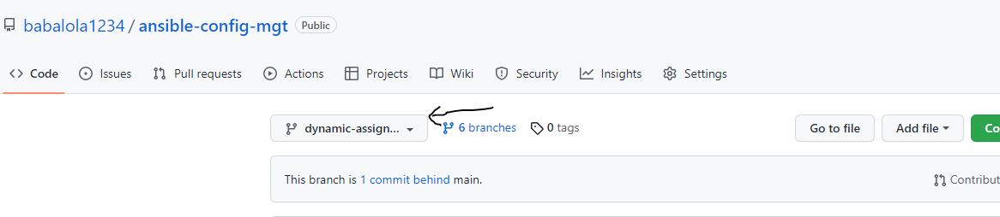

* I also created a new directory localy on ansibled server called ` dynami-assignment ` and created a new file in it called ` env-vars.yml `

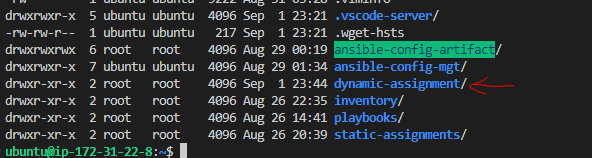

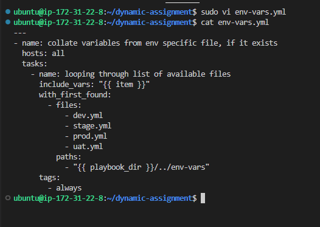

* I created another dir called ` env-vars ` to keep each environemnts variables files.

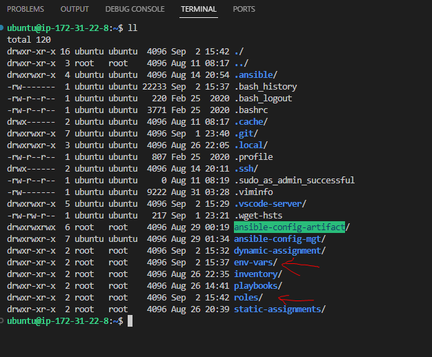

# Updating site.yml with dynamic assignemnets 

* Step 2 I updated site.yml with the statement below in other to make use use of dynamic assignemnet.

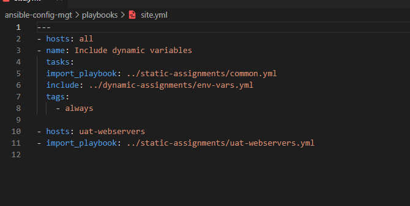

# Using Community Roles to create my MySql database

* Step 3 -- In this case I am  going to use an already created role by geerlingguy. it makes life so simple except that a lot of modifiying needs to be 
done to suite my needs as thr error occurs when runing the playbooks

* Before I downloaded MySQl role,I  Commited and Pushed to ` main branch ` my ` ansible-config-mgt ` 

` git init `

` git pull https://github.com/babalola1234/ansible-config-mgt.git `

` git remote add origin https://github.com/babalola1234/ansible-config-mgt git`

 * Step 4 I created roles inside ` ansible-config-mgt `  Downloaded 
 
 ` MySQL role developed by geerligguy ` and installed it using 
 
 ` ansible-galaxy install geerlingguy.mysql ` and rename it with the command below 

 ` mv geerlingguy.mysql/ mysql `

 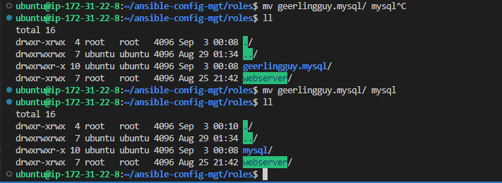

* I made some configurations changes in ` main.yml ` in ` defaults dir ` under ` mysql dir `  according to the ` README.md ` file.  

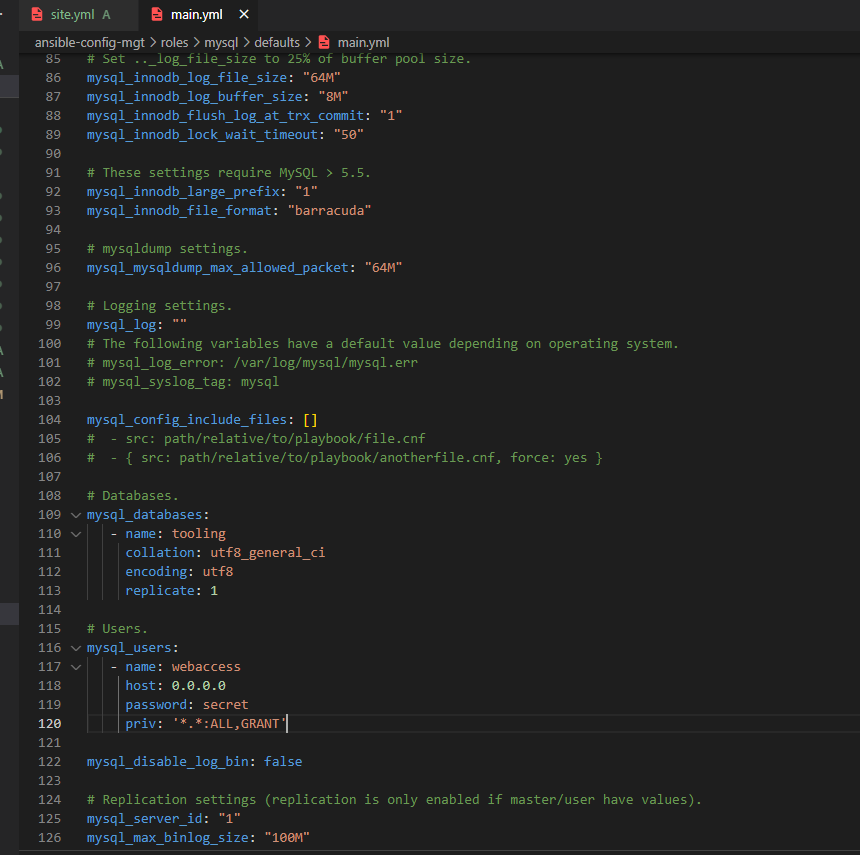

* Now I commited and pushed my new changes below.

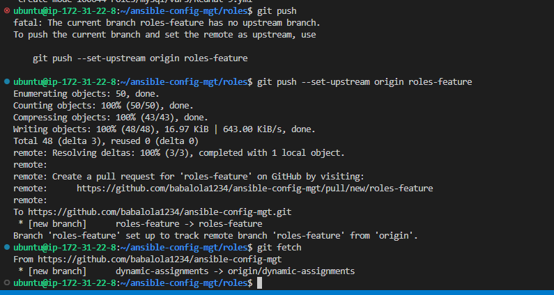

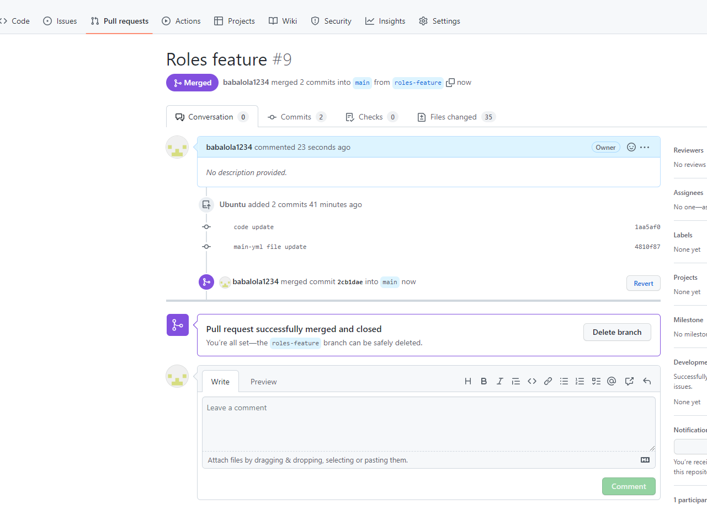

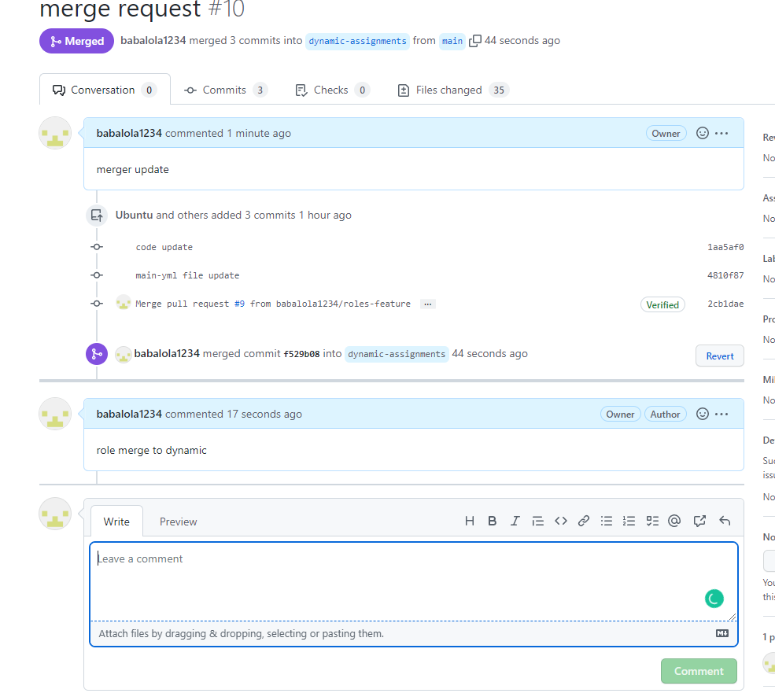

# Creating and Configuring Load balancer Roles for both Nginx and Apache 

Step 1 I am going to use the comunity developed roles from geerliguy as well with some modifications in other to work to suite my environment .

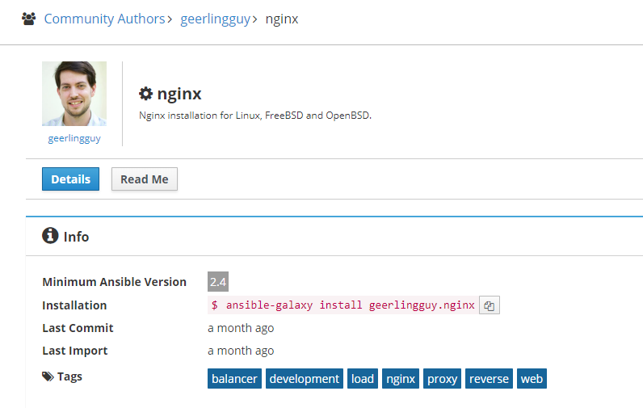

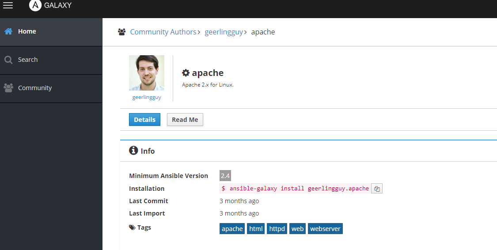

` ansible-galaxy install geerlingguy.nginx `

` ansible-galaxy install geerlingguy.apache `

* Renamining both nginx and apache LBs

` mv geerlingguy.nginx/ nginx && mv geerlingguy.apache/ apache `

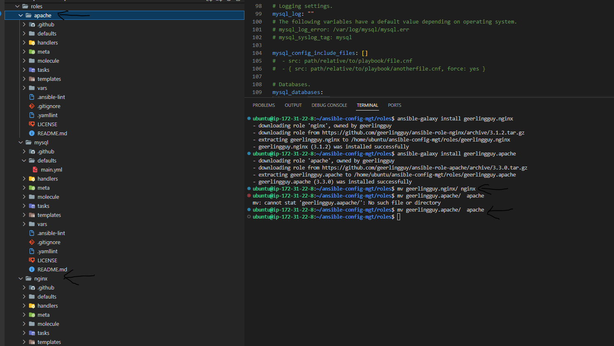

* Edited the main.yml/defaults file with the 2 uat-webservers  and https options, main.yml/tasks and main.yml/templates after reading the README.md file for nginx

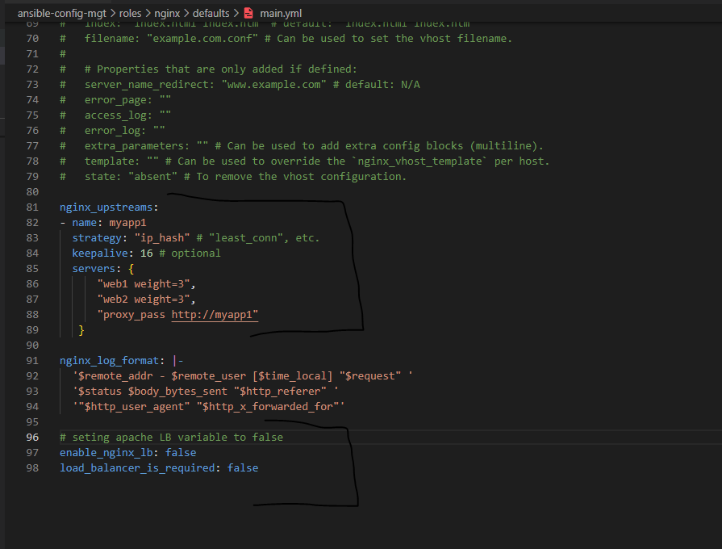

* commited and pushed my nginx and apache config update

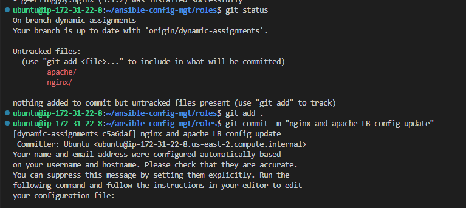

* included some config in main/defaults and set-Redhat.yml

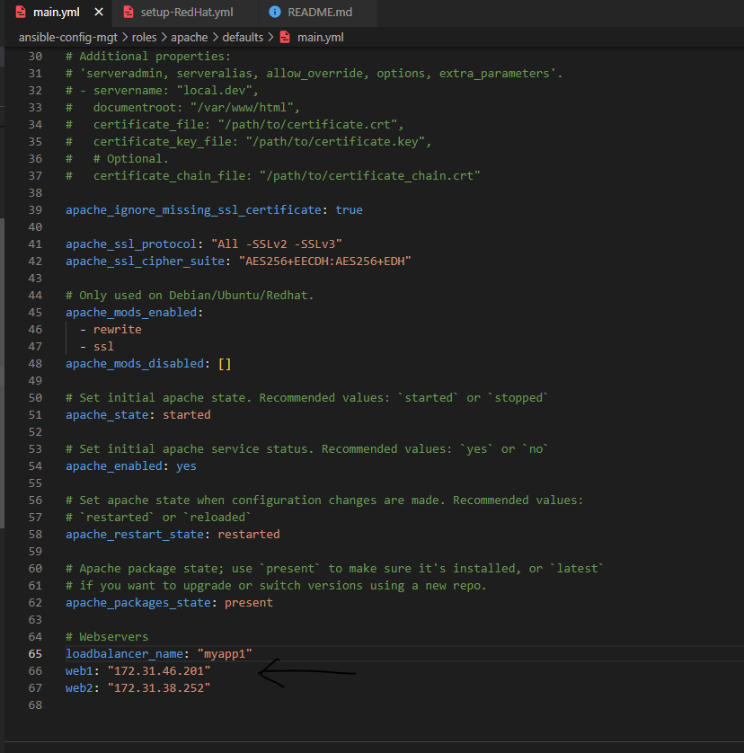

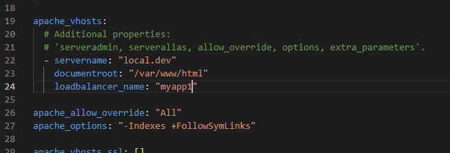

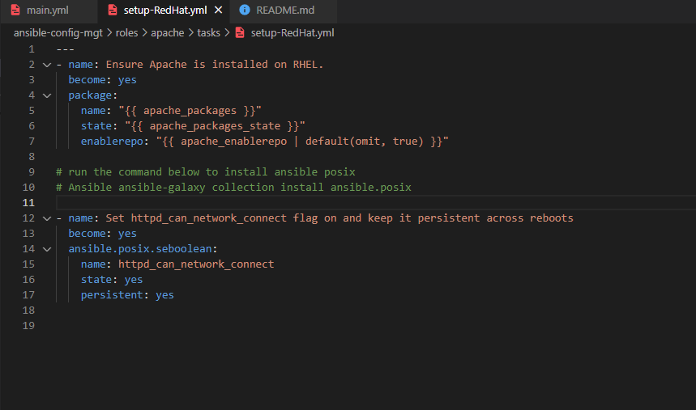

# Since I cant use both Ninx and Apache Load balancer, I need to add a condition to enable one. This can be achived by using variables.

* Declaring variables in ` defaults/main.yml` for both Nginx and Apache . 

* both variable named  ` enable_nginx_lb ` and ` enable_apache_lb ` 

* both values are set to ` false `

` enable_nginx_lb: false ` 

* another variable is declared  ` load_balancer_is_required ` and its set to ` false ` 

` enable_apache_lb: false ` 

* another variable is declared for ` load_balancer_is_required ` 
and its set to ` false ` 

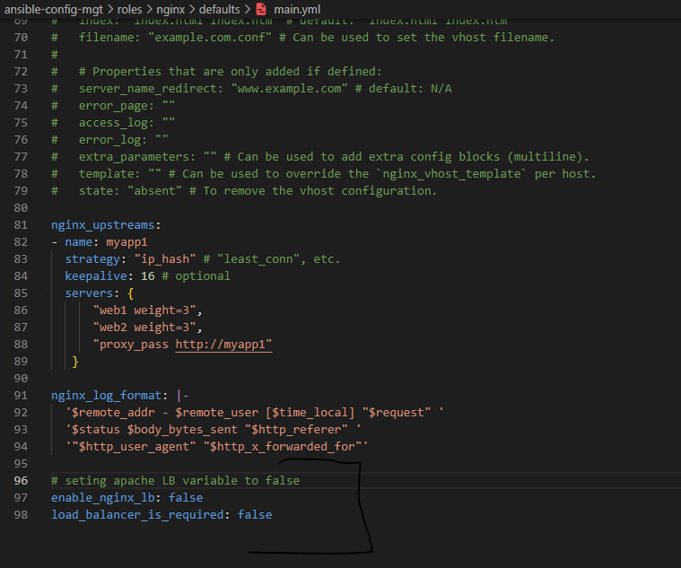

* updated both assignement and site.yml resp.

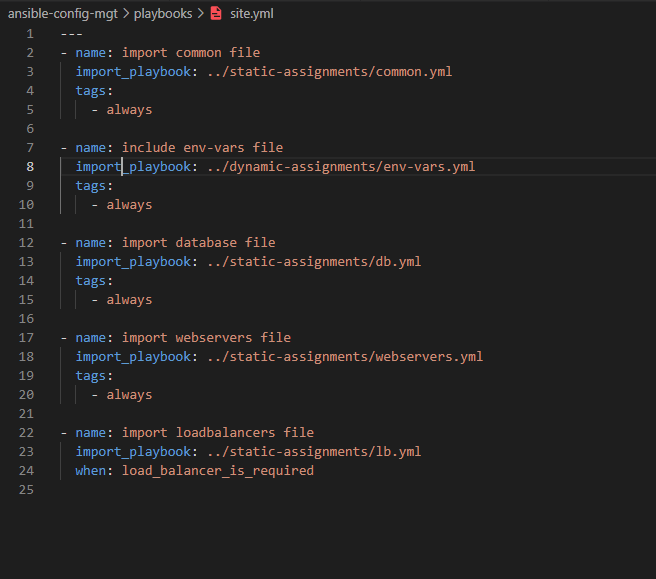

* Runing ansible playbook to test each load uat-loadbalacer.

` ansible-playbook -i inventory/uat.yml playbooks/site.yml `

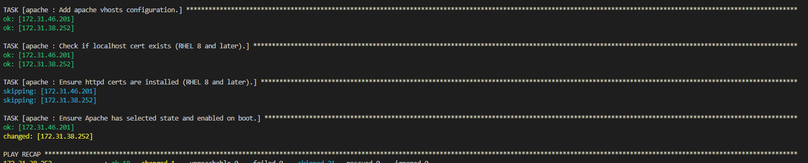

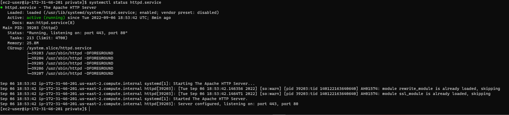

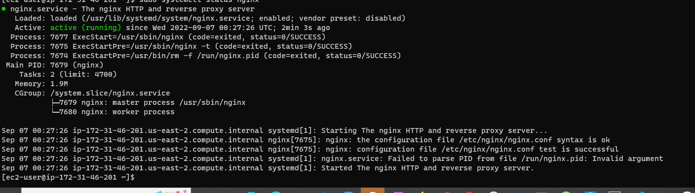

